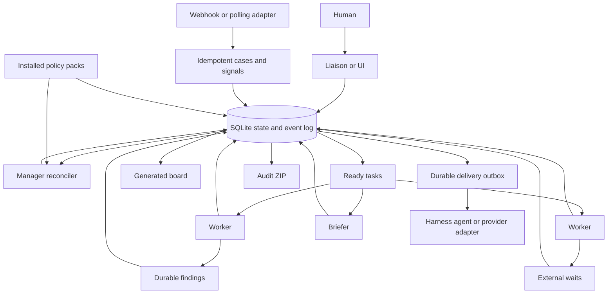

# Swarmkit

Swarmkit is a small coordination layer for giving ambiguous objectives to a group of agents. It does not contain an AI model and does not depend on a particular agent product. Your existing harness launches the agents; Swarmkit gives those agents a shared state machine, durable inboxes, leases, decisions, generated status views, and a complete audit export.

The package uses Python's standard library and SQLite. Copy the Swarmkit directory to the machine where the work happens.

To create a portable ZIP:

```bash
python3 scripts/package.py
```

This writes `dist/swarmkit-0.7.1.zip` with the CLI, guidance, documentation,
examples, policy packs, responsive scheduling, persistent-service cases,
delivery extensions, and deterministic responsive acceptance tests.

If another agent will connect Swarmkit to the harness on the destination
machine, give that agent [SETUP_AGENT.md](SETUP_AGENT.md) as its assignment.
That playbook separates machine-specific discovery from mandatory integration
behavior and includes live acceptance tests. Do not rely on the setup agent to
reverse-engineer the contract from `swarmctl.py`.

## The basic idea

An agent conversation is temporary. The database is permanent. Agents may notify one another that something changed, but every fact that can affect work must first be written to canonical state.



The manager does not need to know the full task plan at the beginning. It starts
with a few bounded investigations and evolves the plan as meaningful evidence
arrives. Manager reviews can run while unrelated workers remain active, and
free capacity can start newly justified work without waiting for a whole wave.

## What is included

- `swarmctl.py`: the CLI and orchestration engine.
- `bin/swarmctl`: a portable launcher.
- `SETUP_AGENT.md`: a complete harness-installation assignment and acceptance suite.
- `guidance/`: strict role contracts suitable for smaller or less reliable models.
- `docs/`: explanations, operating procedures, extension authoring, and harness integration guidance.
- `examples/`: an ambiguous pipeline mission, runner configuration, reusable policy packs, and a harness-email delivery extension.
- `docs/CLI_REFERENCE.md`: generated exact CLI syntax and options.
- `scripts/check_docs.py`: deterministic documentation and contract checks.
- `scripts/release_check.py`: source and extracted-package release verification.
- `tests/`: lifecycle, policy workflow, documentation, decision propagation, inbox, lease, and export tests.

## Requirements

- Python 3.9 or newer.
- An agent harness whose agents can read a prompt file and run local commands.
- A working directory shared by the manager and workers.

SQLite supports concurrent readers and short serialized writes. Swarmkit enables WAL mode and a busy timeout. For large distributed swarms across several machines, replace SQLite with a transactional service while preserving the same protocol.

## Five-minute setup

From the copied Swarmkit directory:

```bash
chmod +x bin/swarmctl
bin/swarmctl --root /work/my-run/.swarm init \
  --objective "Restore reliable delivery through the customer data pipeline" \
  --success "New records reach the destination" \
  --success "Backlog is accounted for without loss or duplication" \
  --success "The failure mode is monitored" \
  --constraint "Ask before destructive production changes" \
  --constraint "Preserve customer data"
```

This creates:

```text
/work/my-run/.swarm/
  state.sqlite3
  runner.json
  prompts/
  runs/
  intake/
  outbox/
  views/BOARD.md
```

Edit `runner.json` so `command` invokes your harness. The command is an argument array, not a shell string:

```json
{
  "command": [
    "your-harness",
    "agent",
    "run",
    "--prompt-file",
    "{prompt_file}",
    "--model",
    "{model}"
  ],
  "working_directory": "/work/target-repository",
  "max_parallel": 3,
  "timeout_seconds": 3600,
  "scheduler_poll_seconds": 1,
  "manager_review_debounce_seconds": 1,
  "models": {
    "manager": "your-stronger-planning-model",
    "worker": "your-lower-cost-model",
    "briefer": "your-lower-cost-model",
    "extension": "your-lower-cost-model",
    "verifier": "your-stronger-review-model"
  }
}
```

Available placeholders are `{prompt_file}`, `{role}`, `{task_id}`, `{agent_id}`, `{root}`, `{workdir}`, and `{model}`. Do not put secrets in this array because invoked commands are preserved in the audit log; supply credentials through the harness's normal secret mechanism.

Check the installation and adapter without launching an agent:

```bash
bin/swarmctl --root /work/my-run/.swarm setup-check
```

Then inspect the expanded invocation:

```bash
bin/swarmctl --root /work/my-run/.swarm dispatch \
  --role manager --agent manager --dry-run
```

Start bounded orchestration cycles:

```bash
bin/swarmctl --root /work/my-run/.swarm run --max-cycles 20
```

The bounded event loop serializes manager reviews, reacts to completed work and
consequential findings while other workers remain active, and fills freed
capacity from current `READY` work. `max_parallel` counts live manager and
worker harness processes. A cycle is one manager launch or one worker batch.
The loop stops when the mission completes, needs a human decision, is waiting
externally, has no ready work, or reaches the cycle limit.

## Responsive execution, findings, and waits

Workers elevate plan-relevant evidence without expanding their own scope:

```bash
bin/swarmctl --root /work/my-run/.swarm finding raise \
  --task T-ID --agent worker-ID --significance MATERIAL \
  --summary "Retries may duplicate records" \
  --evidence "log:event-1042" \
  --impact "Replay correctness is at risk" \
  --recommendation "Inspect replay idempotency"
```

Material and urgent findings request a durable manager review. The manager
must record `INCORPORATED`, `DEFERRED`, or `DISMISSED` with a rationale; only
the manager creates resulting tasks or workstreams.

Waiting for an external provider releases task ownership and agent capacity:

```bash
bin/swarmctl --root /work/my-run/.swarm task wait-external T-ID \
  --agent worker-ID \
  --condition "Pipeline job is terminal" \
  --external-ref provider-job-123 \
  --next-check-at 2030-01-01T00:15:00Z \
  --signal-expected \
  --deadline 2030-01-01T04:00:00Z
```

A scheduled check, provider signal, or deadline wakes the task for fresh
verification; it never records provider success. When only future waits remain,
`run` exits as `WAITING_EXTERNAL` with the next check and deadline. See
[Responsive orchestration](docs/RESPONSIVE_ORCHESTRATION.md) for the complete
state, timing, and integration contract.

Trusted callback adapters wake a wait idempotently with `wait signal`; the
fresh worker still queries the provider before completing the task.

## Persistent agent services

A persistent Swarmkit agent is a stable service identity backed by durable
state, while every actual model invocation remains fresh. Initialize the
standing mission with `--mode SERVICE`; it stays active when idle and accepts
idempotent cases and follow-up signals:

```bash
bin/swarmctl --root /work/change-reviewer/.swarm init \
  --mode SERVICE \
  --objective "Independently review submitted engineering changes" \
  --success "Every request reaches an evidence-backed disposition" \
  --constraint "Only the human may authorize approval"

bin/swarmctl --root /work/change-reviewer/.swarm policy install \
  examples/policy-packs/human-gated-change-review \
  --actor human

bin/swarmctl --root /work/change-reviewer/.swarm case open \
  --source review-provider \
  --external-id project/change/42 \
  --title "Review change 42" \
  --objective "Reach an independent, human-authorized disposition" \
  --payload /work/intake/event.json \
  --policy human-gated-change-review \
  --var change_ref=https://review.example/42 \
  --var review_skill=adversarial-review \
  --var 'verification_command=python3 -m unittest' \
  --ready
```

Provider webhooks and polling stay in an organization-owned ingress adapter.
It records new work through `case open`, author replies or new revisions through
`case signal`, and then invokes a bounded `run`. Duplicate provider events do
not create duplicate work. See [Persistent services](docs/PERSISTENT_SERVICES.md)
for waits, human gates, fresh-context rotation, the generic change-review
example, and adapter safety.

## Adding organization-specific workflows

Policy packs keep project or organization practices outside Swarmkit while
making their stages durable and enforceable. A pack contributes declarative
tasks, dependencies, fresh-agent constraints, and additional task guidance. It
does not add provider credentials or executable code to the core.

Validate and install the bundled PR-review example:

```bash
bin/swarmctl policy validate examples/policy-packs/pr-adversarial-review

bin/swarmctl --root /work/my-run/.swarm policy install \
  examples/policy-packs/pr-adversarial-review \
  --actor human
```

Apply it when a workstream will produce a pull request:

```bash
bin/swarmctl --root /work/my-run/.swarm policy apply \
  pr-adversarial-review \
  --workstream WS-ID \
  --var 'goal=prevent duplicate replay records' \
  --var 'test_command=python3 -m unittest' \
  --ready
```

This creates five ordered tasks: implement and open the PR, run the harness's
`adversarial-review` skill, remediate and restore green checks, run the skill
again from a fresh agent identity, and resolve any final findings. See
[Policy packs](docs/POLICY_PACKS.md) for the contract and authoring guide.

## Connecting reports to email, chat, or another system

Swarmkit generates report content and owns a durable delivery outbox; an
extension uses capabilities and authentication that already exist in your
harness or a reviewed command-line adapter. The core never stores provider
credentials.

Validate and install the bundled agent-executor example after copying it and
replacing its recipient allowlist:

```bash
bin/swarmctl extension validate examples/extensions/harness-email

bin/swarmctl --root /work/my-run/.swarm extension install \
  examples/extensions/harness-email \
  --actor human
```

Queue an immutable executive report, then dispatch the returned delivery ID:

```bash
bin/swarmctl --root /work/my-run/.swarm delivery enqueue-report \
  --extension harness-email-example \
  --channel email \
  --subject "Pipeline recovery status" \
  --recipient replace-me@example.com \
  --idempotency-key "pipeline-status-2026-09-05T2200Z"

bin/swarmctl --root /work/my-run/.swarm delivery dispatch N-ID \
  --agent status-emailer
```

The extension must record a provider receipt before the delivery becomes
`SENT`. Leases, explicit retry, content hashes, and idempotency keys make
timeouts and context loss observable and recoverable. See
[Extensions](docs/EXTENSIONS.md) for the manifest, scheduler, command-adapter,
UI, and security contracts.

## Answering a blocked question

List canonical decisions:

```bash
bin/swarmctl --root /work/my-run/.swarm decision list
```

Record the answer:

```bash
bin/swarmctl --root /work/my-run/.swarm decision resolve D-EXAMPLE \
  --answer "Pause ingestion for the controlled repair window" \
  --actor human
```

Do not send the answer directly to the worker. Resolution emits an event and makes affected work eligible to resume. The next owner must acknowledge the decision version before checkpointing or completing the task. Restart `run` after answering if the prior invocation stopped in `WAITING_FOR_DECISION`.

If the answer later changes, use `decision revise`; the new version invalidates old acknowledgments and fences active owners. Use `decision link` when the same answer affects additional tasks.

## Getting status

`views/BOARD.md` is generated from SQLite and must not be edited manually:

```bash
bin/swarmctl --root /work/my-run/.swarm board
bin/swarmctl --root /work/my-run/.swarm report
bin/swarmctl --root /work/my-run/.swarm doctor
bin/swarmctl --root /work/my-run/.swarm status
```

Your existing UI or scheduler can invoke these commands. `report` writes `views/STATUS.md` with external waits and wake conditions, untriaged findings, the mission, major workstreams, expected timing, human needs, invariant failures, failed runs, delivery failures, ready work, and active work. A status agent is optional; most status reporting should be deterministic formatting of the canonical state. Use a delivery extension when the report must be pushed externally.

Record a mutable operational fact with a source and expiry:

```bash
bin/swarmctl --root /work/my-run/.swarm fact record \
  --subject "destination-api-health" \
  --value "healthy; controlled write succeeded" \
  --source "health check and request ID req-123" \
  --actor worker-2 \
  --task T-EXAMPLE \
  --ttl-seconds 300
```

A new current fact with the same subject supersedes the previous one. The reconciler expires facts after their deadline, preventing an old observation from remaining current indefinitely.

## Exporting a completed run for review

```bash
bin/swarmctl --root /work/my-run/.swarm export \
  --output /work/exports/pipeline-run.zip \
  --include-artifacts
```

The archive contains:

- the SQLite database;
- a complete chronological `events.jsonl`;
- a compact `snapshot.json` plus complete persistent-service histories in `cases.json`;
- mission, task, decision, acknowledgment, finding, external-wait, manager-review, artifact, extension, and delivery records;
- all generated agent prompts;
- captured harness stdout and stderr;
- the final board and invariant report;
- registered artifacts up to the configured per-file size limit;
- `REVIEW_ME.md`, which tells a future reviewer how to audit the run.

Prompts and captured output can contain confidential information. Inspect the archive before moving it outside the trusted environment.

## Why this works with less capable models

Smaller models need less implicit judgment and more executable structure. Swarmkit places the important behavior in mechanisms they cannot accidentally omit:

- SQLite enforces durable records and relationships.
- The CLI enforces leases, ownership, task transitions, decision acknowledgment, and completion evidence.
- Generated prompts include the exact mission, task, decisions, unseen events, agent identity, and command prefix.
- Role guides provide one short algorithm per invocation.
- The reconciler computes readiness rather than asking a model to remember dependencies.
- Audit exports make repeated failures measurable instead of anecdotal.

Do not compensate for a weaker model with one enormous prompt. Give it a narrow role, current state, exact commands, bounded choices, and observable completion criteria. See [Designing for smaller models](docs/MODEL_GUIDANCE.md) for the detailed guidance.

## Operating principle

The system should spend parallelism on gathering independent evidence. It should converge before tightly coupled changes. One worker owns a coherent implementation; short-lived agents can investigate, brief, and verify around it.

Start with the [User manual](docs/USER_MANUAL.md) for common journeys. See [System explainer](docs/SYSTEM_EXPLAINER.md) for the architecture, [Responsive orchestration](docs/RESPONSIVE_ORCHESTRATION.md) for evolving plans, findings, and external waits, [Harness integration](docs/HARNESS_INTEGRATION.md) for the adapter contract, [Persistent services](docs/PERSISTENT_SERVICES.md) for standing-agent intake, [Policy packs](docs/POLICY_PACKS.md) for workflow extensions, [Extensions](docs/EXTENSIONS.md) for delivery adapters, [CLI reference](docs/CLI_REFERENCE.md) for exact syntax, [Documentation policy](docs/DOCUMENTATION_POLICY.md) for change requirements, and [setup-agent playbook](SETUP_AGENT.md) when moving the package to a new harness machine.

To exercise the state machine without an AI harness, run the synthetic demonstration against a new directory:

```bash
python3 examples/demo_lifecycle.py \
  --root /tmp/swarmkit-demo/.swarm \
  --output /tmp/swarmkit-demo-audit.zip
```

## Runtime safety and recovery (0.7.0)

The [durable runtime contract](docs/RUNTIME_SAFETY.md) documents `pause`, `drain`,
`resume`, `cancel`, `abandon`, `recover`, `why`, and `serve`, along with leased
inboxes, effect reconciliation, task worktrees, resource leases, evidence
contracts, amendments, limits, model escalation, and audit verification.
Use its examples for new integrations. The
[roadmap backlog](docs/ROADMAP_BACKLOG.md) distinguishes shipped slices from remaining
engineering work and owner decisions. Permission enforcement stays with the
harness and tools. Runtime process locking requires a single POSIX host.

Workspace isolation is VCS-neutral: register a checkout created by your harness,
configure an internal checkout CLI once, or explicitly select Git worktrees.
See [workspace providers](docs/RUNTIME_SAFETY.md#isolate-files-and-scarce-resources).
